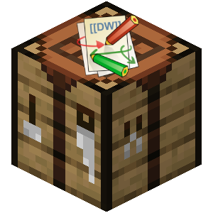
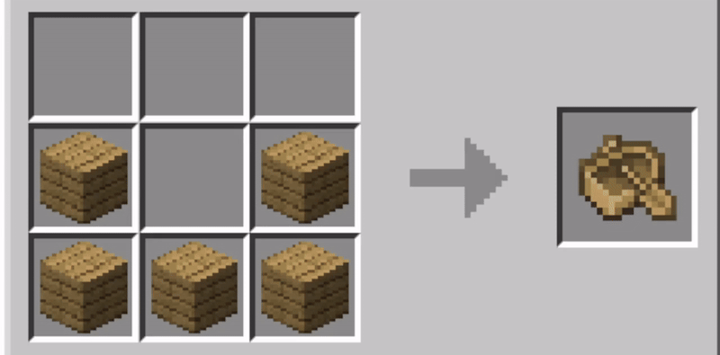

<p align="center">
    
</p>

<div align="center"><h1>minecraftrecipe</h1></div>

<div align="center">
A Dokuwiki plugin to render minecraft recipe previews on your wikis. Useful for modders, servers, and other blockgame enthusiasts. 
</div>
<br></br>

# Table of Contents
- [Installation](#installation)
- [Usage](#usage)
  - [Syntax](#syntax)
  - [Items](#items)
  - [Item Groups](#item-groups)
- [Extension Commands](#extension-commands)
- [License](#license)
- [Disclaimer](#disclaimer)

# Installation
Run `git clone https://github.com/tlm9201/dokuwiki-plugin-minecraftrecipe minecraftrecipe` under your DokuWiki plugins directory.

Login as admin and ensure it is enabled in the extensions manager.

# Usage

DokuWiki currently supports 3 recipe types, `crafting`, `smelting`, and `brewing`.

The type is specified using the `type` tag:
```xml
<recipe type="crafting">
</recipe>
```

## Syntax

The syntax for each type is as follows:

### Crafting
```xml
<recipe type="crafting">
slot_0 slot_1 slot_2
slot_3 slot_4 slot_5
slot_6 slot_7 slot_8
-> result
</recipe>
```

### Smelting
```xml
<recipe type="smelting">
input
fuel
-> result
</recipe>
```

### Brewing
```xml
<recipe type="brewing">
reagent
-> potion_0 potion_1 potion_2
</recipe>
```

## Items
Items are defined under `./images/item/item_id.png`.
For air, use `empty` or `x`.

For example, the recipe for a diamond block would be:
```xml
<recipe type="crafting">
diamond diamond diamond
diamond diamond diamond
diamond diamond diamond
-> block_of_diamond
</recipe>
```

> ![NOTE]
> If the specified item id cannot be found, it will fallback to minecraft.wiki and attempt to lookup the sprite there. Assets on minecraft.wiki are case sensitive.

## Item Groups
Groups of items are declared using commas.

For example, a boat using different wood types.
(Yes it can be a little verbose).
```xml
<recipe type="crafting">
x x x
Oak_Planks,Spruce_Planks,Birch_Planks x Oak_Planks,Spruce_Planks,Birch_Planks
Oak_Planks,Spruce_Planks,Birch_Planks Oak_Planks,Spruce_Planks,Birch_Planks Oak_Planks,Spruce_Planks,Birch_Planks
-> Oak_Boat,Spruce_Boat,Birch_Boat
</recipe>
```

Output:


<br></br>

# License
```
dokuwiki-plugin-minecraftrecipe  Copyright (C) 2025  tlm920

    This program is free software: you can redistribute it and/or modify
    it under the terms of the GNU General Public License as published by
    the Free Software Foundation, either version 3 of the License, or
    (at your option) any later version.

    This program is distributed in the hope that it will be useful,
    but WITHOUT ANY WARRANTY; without even the implied warranty of
    MERCHANTABILITY or FITNESS FOR A PARTICULAR PURPOSE.  See the
    GNU General Public License for more details.

    You should have received a copy of the GNU General Public License
    along with this program.  If not, see <https://www.gnu.org/licenses/>.
```

## Disclaimer
I am in no way affiliated with Mojang Studios, nor am I endorsed by Mojang Studios.
All assets under `./images` and its subdirectories are intellectual property of Mojang Studios.

Minecraft ®/TM, Mojang Studios / Notch © 2009-2025